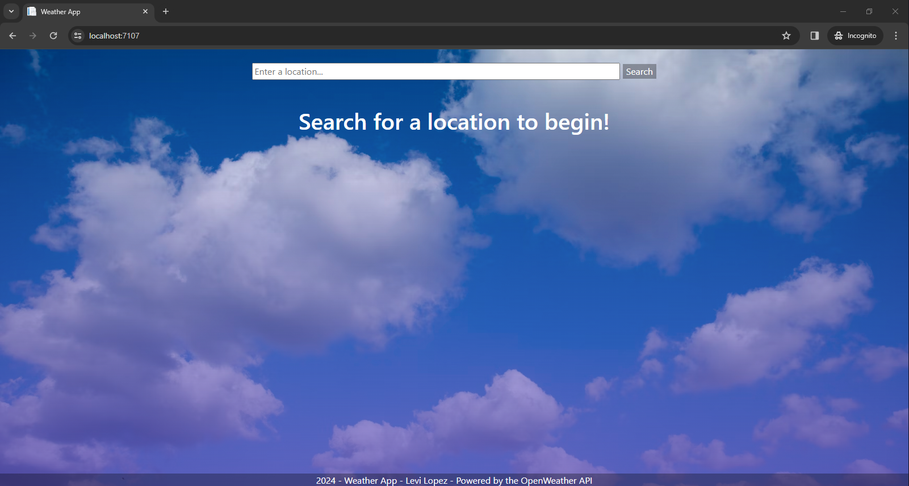
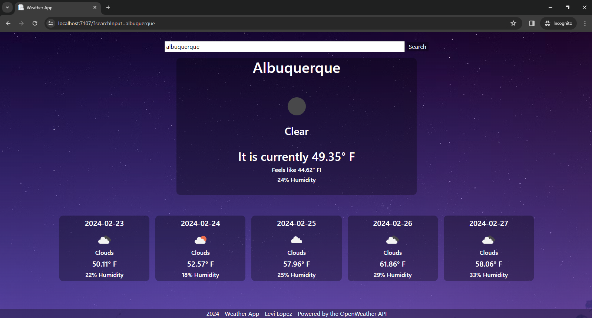
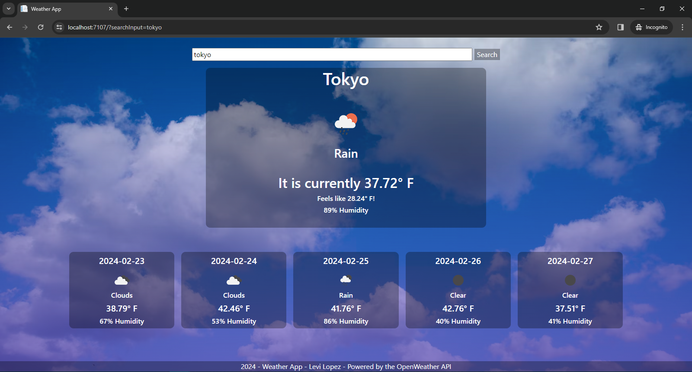

# Weather App

An app for checking the current weather, as well as the weather for the next few days, implemented using ASP.NET MVC and Bootstrap.

## Technologies
.Net, C#, ASP.NET MVC, HTML, CSS, Bootstrap

## Features
- Search for a location to check the weather and forecast at that location
- Background and images change depending on the time at the given location, as well as the weather
